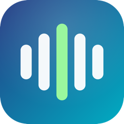

# DACSync

[](https://github.com/5uw1/purerate/actions/workflows/build.yml)
[](https://github.com/5uw1/purerate/releases/latest)

A macOS menu-bar utility that watches Apple Music and automatically matches
your audio output device's sample rate (and, optionally, bit depth) to
whatever's actually playing — so macOS never has to resample Lossless or
Hi-Res Lossless tracks before handing them to your DAC/amp.

Windows and a browser extension for YouTube are planned for later phases —
see [Roadmap](#roadmap).

## Features

- **Automatic sample-rate switching** — detects the format of the track
  Apple Music is playing (e.g. 44.1kHz, 48kHz, 96kHz) and sets your output
  device to match, in real time, with no input needed.
- **Menu bar label shows the current format at a glance** — e.g. `44K`,
  `96K`, or `96K/24` — instead of a static icon.
- **Switch history** — a timestamped log of every real format change, so
  you can see what happened while you weren't looking.
- **Syncs on launch** — if a track is already playing when DACSync starts,
  it catches up immediately instead of waiting for the next track change.
- **Launch at Login** — runs automatically in the background.
- **(Advanced, off by default) Bit-depth switching** — can also set your
  DAC's physical bit depth (e.g. 16-bit vs 24-bit) to match the source,
  for DACs that expose more than one. Requires "exclusive access," which
  **can silence your audio** — see [Exclusive access](#exclusive-access--bit-depth-advanced-off-by-default)
  before turning it on.

## Quick start

**Download:** grab the latest `DACSync-macOS.zip` from
[Releases](https://github.com/5uw1/purerate/releases), unzip it, and move
`DACSync.app` to `/Applications`.

**Or build from source** (small, fast to build):

```bash
git clone https://github.com/5uw1/purerate.git
cd purerate
scripts/build-app.sh
mv build/DACSync.app /Applications/
```

Then launch it:

```bash
open /Applications/DACSync.app
```

The build isn't notarized (see [Roadmap](#roadmap)), so the first launch
will likely be blocked by Gatekeeper as "unidentified developer." Right-click
the app in Finder and choose **Open** (rather than double-clicking) to get
past that — you only need to do this once.

A `96K`-style label appears in your menu bar (no Dock icon — it's a
background utility). Click it to open the menu.

If you want it to start automatically, click **Launch at login** in the
menu after moving the app to `/Applications` (see
[Requirements](#requirements) for why the location matters).

## Using the menu

Click the menu bar label to open:

| Item | What it does |
|---|---|
| **Auto-switch sample rate** | The main on/off switch. When on, DACSync tracks Apple Music and matches your device's sample rate automatically. Turning it off restores your device to whatever it was set to before DACSync touched it. |
| **Take exclusive access (hog mode)** | Advanced, off by default — enables bit-depth switching. Reverts automatically every time you relaunch the app. **Read [the warning below](#exclusive-access--bit-depth-advanced-off-by-default) before enabling.** |
| **Launch at login** | Adds/removes DACSync as a Login Item. |
| **Output device** | Picker for which audio device DACSync manages, if you have more than one. |
| **Device: ...** | The device's current sample rate (and bit depth, if exclusive access is active). |
| **Last detected: ...** | The format DACSync most recently saw Apple Music report. |
| **Switch history** | Timestamped log of real changes — e.g. `19:33:10 — 44K` then `19:33:23 — 96K`. Only actual changes are logged, not every check. |
| **Show raw log matches** | Debug view of the raw system log lines DACSync is parsing — useful if detection seems stuck (see [Troubleshooting](#troubleshooting)). |
| **Refresh devices** | Re-scans available output devices, and re-resolves the target device if it dropped out (see [Device re-enumeration](#device-re-enumeration)). |

### Exclusive access / bit depth (advanced, off by default)

**DACSync doesn't play audio — Apple Music does.** Bit-depth switching
requires "Hog Mode," which grants *DACSync's own process* exclusive access
to the output device. That blocks Apple Music (a separate process) from
opening or holding its own audio stream to the same device — so turning
this on can **silence your audio entirely**. This isn't a bug to be fixed;
it's inherent to how Hog Mode works, and only really makes sense for apps
that are themselves the audio player (Audirvana, BitPerfect).

Because of that:
- It's **off every time you launch DACSync**, regardless of what it was
  set to last — it never silently re-engages.
- Turning it on shows a warning directly in the menu.
- Sample-rate-only switching (the default, main feature) does not have
  this problem and works reliably without it.

Only enable this if you understand the tradeoff and want to experiment.

## Requirements

- macOS 13 or later.
- Your account must be an **admin** user — DACSync reads the live system
  log (`log stream`) to detect what Apple Music is playing, which requires
  it.
- To use **Launch at Login**, the app needs to be running from a stable
  location (e.g. `/Applications`) — macOS's Login Item registration is
  tied to the app's path.

## Troubleshooting

**DACSync isn't detecting format changes.** Open the menu and enable
**Show raw log matches** while playing a Lossless/Hi-Res track — you
should see matching lines appear. If nothing shows up, Apple may have
changed the log format DACSync relies on (it's undocumented and can shift
between macOS/Music versions) — see
[Log line patterns](#log-line-patterns) below for how to recapture it.

**The target device keeps "forgetting" itself / switching stops working
after a while.** Some DACs re-enumerate under a new device ID when their
format changes, or when Hog Mode is engaged/released. DACSync watches for
this and re-resolves the device automatically by name, but if it ever gets
stuck, click **Refresh devices**.

**I turned on exclusive access and now there's no sound.** This is
expected — see [Exclusive access](#exclusive-access--bit-depth-advanced-off-by-default)
above. Just turn the toggle off, or quit and relaunch DACSync (it never
restores that setting automatically).

## How it works

There is no public API for "what format is Apple Music currently
decoding." The approach here — the same technique used by the prior art
[LosslessSwitcher](https://github.com/vincentneo/LosslessSwitcher) (GPL-3.0;
no code from that project is reused here, only the general technique) — is:

1. **Detect**: shell out to `/usr/bin/log stream`, filtered to Music.app's
   processes, and pattern-match log lines for sample rate / bit depth text
   (`PlaybackFormatMonitor.swift`, `FormatLineParser`).
2. **Switch**: when a new format is detected, use CoreAudio's HAL APIs to
   set the target output device's nominal sample rate to match — picking an
   exact match if the DAC supports it, otherwise the closest rate in the
   same 44.1kHz/48kHz family (`CoreAudioController.swift`).
3. **Hold the device** (optional, see above): "hog mode" takes exclusive
   access to the output device so the shared system mixer can't reopen it
   at a mismatched rate mid-track.
4. **Match bit depth** (optional, needs exclusive access): sets each output
   stream's *physical* format (`kAudioStreamPropertyPhysicalFormat`) — the
   actual hardware wire format, separate from the device-wide nominal
   sample rate — to the source's bit depth where the DAC offers more than
   one (`CoreAudioController.matchBitDepth`).
5. **Sync on launch / periodically**: `log stream` only sees *new* log
   lines, so a track already playing before DACSync (re)launched is
   otherwise invisible until the next track change. `MusicScriptBridge`
   asks Music directly via AppleScript (`sample rate of current track` —
   an officially exposed property, confirmed accurate) right at launch and
   every 20s afterward, closing that gap for sample rate (it doesn't expose
   bit depth, so that still comes from the log-based detection above).

### Log line patterns

`FormatLineParser`'s regexes were captured live from Music.app on macOS
26.6 (see the commit history) while switching between an AAC track, a
44.1kHz/16-bit Lossless track, and a 96kHz/24-bit Hi-Res Lossless one — not
guessed. The three matched lines
(`fpfs_ReportAudioPlaybackThroughFigLog`'s `[BitDepth]`/`[SampleRate]`
tags, `ACAppleLosslessDecoder`'s "Input format" line, and the `ampplay`
`mediaFormatinfo` line) only ever fire while Music is actually decoding
ALAC — the AAC track produced none of them — so a match is inherently a
lossless-playback signal.

Apple doesn't document these strings, so a future macOS/Music update can
change them. To recapture:

```bash
log stream --style compact --level debug --predicate \
  'process == "Music" AND (eventMessage CONTAINS "BitDepth" OR eventMessage CONTAINS "ACAppleLosslessDecoder" OR eventMessage CONTAINS "PBAudioFormat" OR eventMessage CONTAINS "mediaFormatinfo")'
```

while switching tracks, and adjust the regexes in
`Sources/DACSync/PlaybackFormatMonitor.swift` to match what you see.

### Device re-enumeration

Changing a stream's *physical* format can make CoreAudio re-enumerate the
device under a **new AudioDeviceID**, unlike a plain nominal-rate change.
On at least one real DAC, *engaging or releasing Hog Mode itself* was also
observed doing this — almost certainly the USB interface briefly resetting
for an internal relay/clock reconfiguration. Since quitting DACSync
releases Hog Mode, relaunching right away can race that reset and catch
the device mid-disappearance.

Two things handle this:
- `AppState` watches `kAudioHardwarePropertyDevices` and re-resolves
  `targetDeviceID` by name when the cached ID goes stale
  (`CoreAudioController.deviceExists`, `AppState.handleDeviceListChanged`).
- The target device is persisted **by name**, not just ID
  (`targetDeviceName` in `UserDefaults`), with a short retry on launch if
  the name isn't found immediately. This matters because the system's own
  "default output device" pointer isn't reliable to fall back on either —
  on a multi-device Mac, another audio device flickering in as default has
  been observed hijacking the target away from the DAC actually chosen.

## Building & running

For development (rebuild-and-relaunch loop):

```bash
swift build
swift run
```

Note: `swift run` does **not** support the Launch at Login toggle —
`SMAppService.mainApp` (`LaunchAtLogin.swift`) only works when DACSync is
actually running as a bundled `.app`. Use the packaged build below to test
that.

### Packaged `.app` (for real use / Login Item)

```bash
scripts/build-app.sh
open build/DACSync.app
```

This builds a release binary and hand-assembles `build/DACSync.app`
(`Contents/MacOS`, `Contents/Info.plist`, ad-hoc code signature) — there's
no Xcode project here to Archive, since this is a plain SwiftPM package.
To actually run at login, move `DACSync.app` somewhere stable (e.g.
`/Applications`) first, then toggle **Launch at login** from the menu; it
shows up under System Settings → General → Login Items afterward.

If you have an Apple Developer ID, sign with that instead of ad hoc
(edit the `codesign` line in `scripts/build-app.sh`) — a Login Item
registered under a real signing identity survives rebuilds more reliably
than one registered under an ad-hoc signature, which changes on every
build.

### App icon

`Resources/AppIcon.icns` is committed as a binary asset and copied into the
bundle by `scripts/build-app.sh`; it isn't regenerated on every build. To
change the design, edit `scripts/generate_icon.swift` (draws the 1024x1024
source via CoreGraphics — no external design tool needed) and rebuild it:

```bash
swift scripts/generate_icon.swift   # writes Resources/AppIcon.png
# then re-derive the .iconset -> .icns (sips + iconutil), e.g.:
rm -rf Resources/AppIcon.iconset && mkdir Resources/AppIcon.iconset
for sz in 16 32 128 256 512; do
  sips -z $sz $sz Resources/AppIcon.png --out "Resources/AppIcon.iconset/icon_${sz}x${sz}.png" >/dev/null
  sips -z $((sz*2)) $((sz*2)) Resources/AppIcon.png --out "Resources/AppIcon.iconset/icon_${sz}x${sz}@2x.png" >/dev/null
done
cp Resources/AppIcon.png Resources/AppIcon.iconset/icon_512x512@2x.png
iconutil -c icns Resources/AppIcon.iconset -o Resources/AppIcon.icns
rm -rf Resources/AppIcon.iconset
```

macOS caches app icons aggressively — after installing a rebuilt `.app`,
`killall Finder` (or log out/in) if the old icon still shows.

## Roadmap

- [x] macOS: detect Apple Music format via log scraping, auto-switch output
      device sample rate via CoreAudio (this repo, phase 1)
- [x] macOS: proper `.app` packaging (`scripts/build-app.sh`) and a
      Launch at Login toggle (`SMAppService.mainApp`)
- [x] macOS: bit-depth-aware exclusive-mode stream format selection
      (`CoreAudioController.matchBitDepth`) — mechanically verified against
      a real external DAC, but silences audio when enabled (see above) —
      opt-in, not persisted between launches, not the recommended way to
      use the app
- [x] macOS: custom app icon (`Resources/AppIcon.icns`, generated by
      `scripts/generate_icon.swift`)
- [x] macOS: restore original format when auto-switch/exclusive access is
      turned off, instead of leaving the device stuck
- [x] macOS: visible switch history log in the menu
- [x] CI: GitHub Actions build (`.github/workflows/build.yml`) — tag pushes
      (`v*`) publish a Release with a downloadable `DACSync-macOS.zip`;
      pushes to `main` upload the same zip as a workflow artifact for
      testing a build without cutting a release
- [ ] macOS: Developer ID signing & notarization (would remove the
      Gatekeeper "unidentified developer" prompt on first launch)
- [ ] Windows: WASAPI exclusive-mode equivalent (C++ or C#), format
      detection strategy TBD per source app (no Apple Music on Windows —
      likely Tidal/Qobuz-specific approaches)
- [ ] Browser extension (Chrome/Firefox) for YouTube: bridges to the native
      app via Native Messaging; scope limited by the fact that YouTube
      transcodes audio (Opus/AAC, fixed rates) so there's no "source format"
      to match the way there is with Apple Music Lossless

## License

MIT — see [LICENSE](LICENSE). This is an independent implementation; it does
not incorporate code from LosslessSwitcher (GPL-3.0), only the publicly
documented technique.
